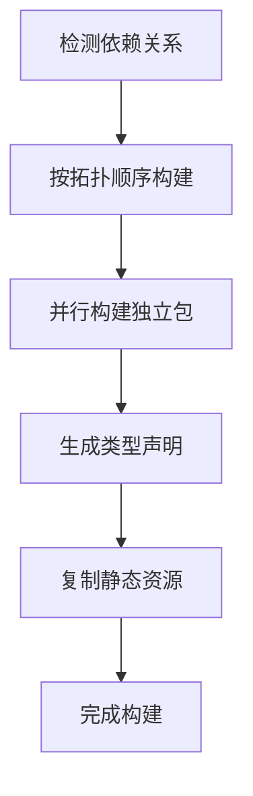
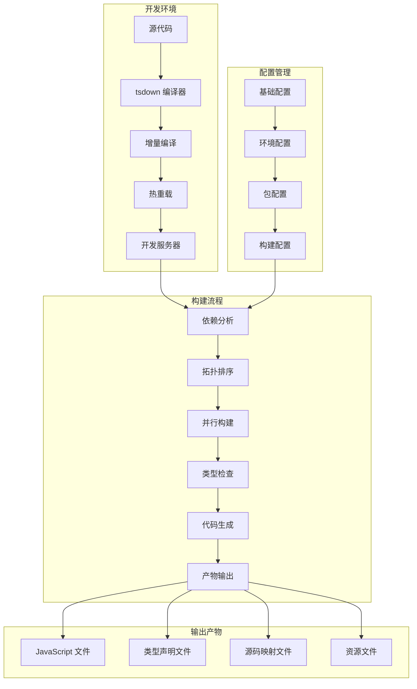

# Haiku Animator 技术栈架构设计：从 tsc 迁移到 tsdown

## 升级状态

**状态**: ✅ 已完成

项目已成功完成从 tsc 到 tsdown 的迁移，包括：

- ✅ 创建了根级别和包级别的 tsdown 配置文件
- ✅ 更新了构建脚本以使用 tsdown
- ✅ 实现了新的开发工作流
- ✅ 优化了构建性能和开发体验

## 1. 当前项目结构分析

### 1.1 项目概述

Haiku Animator 是一个基于 Yarn Workspaces 的 monorepo 项目，包含以下核心包：

- `haiku-plumbing`: 核心序列化和进程管理
- `haiku-glass`: UI 组件库
- `haiku-creator`: 主应用程序
- `haiku-sdk-creator`: SDK 创建工具
- `haiku-formats`: 格式定义
- `haiku-fs-extra`: 文件系统扩展
- `haiku-timeline`: 时间轴组件
- `haiku-ui-common`: 通用 UI 组件
- `haiku-serialization`: 序列化工具
- `haiku-testing`: 测试工具
- `haiku-vendor-legacy`: 遗留第三方库

### 1.2 当前构建流程

- 使用 TypeScript 3.0.3 和 tsc 作为编译器
- 各包独立编译，输出到 `lib` 目录
- 使用 `tsc-watch` 进行开发时监听
- 通过 `scripts/compile-all.js` 批量编译所有包
- 使用 `scripts/watch-all.js` 进行全局监听

## 2. 新的 tsdown 构建架构设计

### 2.1 tsdown 配置方案

#### 2.1.1 根目录配置

```typescript
import { resolve } from 'node:path'
// tsdown.config.ts
import { defineConfig } from 'tsdown'

export default defineConfig({
  entry: {
    // 根据需要配置入口点
  },
  outDir: 'dist',
  format: ['cjs', 'esm'],
  dts: true,
  clean: true,
  external: [
    // 外部依赖配置
  ],
  alias: {
    '@': resolve(__dirname, 'src'),
    '@shared': resolve(__dirname, 'shared'),
  },
  plugins: [
    // 插件配置
  ],
})
```

#### 2.1.2 包级别配置

每个包可以有自己的 `tsdown.config.ts`，继承根配置：

```typescript
import { resolve } from 'node:path'
// packages/haiku-plumbing/tsdown.config.ts
import { defineConfig } from 'tsdown'
import baseConfig from '../../tsdown.config'

export default defineConfig({
  ...baseConfig,
  entry: {
    index: resolve(__dirname, 'src/index.ts'),
    // 其他入口点
  },
  outDir: resolve(__dirname, 'lib'),
  external: [
    ...baseConfig.external,
    'electron',
    // 包特定的外部依赖
  ],
})
```

### 2.2 多包项目构建流程

#### 2.2.1 构建策略



#### 2.2.2 构建脚本设计

```typescript
// scripts/build-with-tsdown.ts
import { execSync } from 'node:child_process'
import { resolve } from 'node:path'
import { getPackagesInBuildOrder } from './helpers/packages'

async function buildAll() {
  const packages = getPackagesInBuildOrder()

  for (const pkg of packages) {
    console.log(`Building ${pkg.name}...`)
    process.chdir(pkg.abspath)

    // 检查是否有 tsdown.config.ts
    if (await fileExists('tsdown.config.ts')) {
      execSync('tsdown', { stdio: 'inherit' })
    }
    else {
      console.log(`Skipping ${pkg.name} (no tsdown.config.ts)`)
    }
  }
}

buildAll().catch(console.error)
```

### 2.3 开发环境和生产环境构建策略

#### 2.3.1 开发环境

- 启用源码映射
- 快速增量编译
- 热重载支持
- 详细错误信息

#### 2.3.2 生产环境

- 代码压缩和优化
- 移除调试信息
- 依赖树优化
- 类型声明生成

### 2.4 与现有 Webpack 配置的集成

```typescript
// webpack.tsdown-integration.js
const TsdownPlugin = require('tsdown-webpack-plugin')

module.exports = {
  // ... 其他 webpack 配置
  module: {
    rules: [
      {
        test: /\.tsx?$/,
        use: TsdownPlugin.loader,
        exclude: /node_modules/,
      },
    ],
  },
  plugins: [
    new TsdownPlugin({
      // tsdown 配置选项
    }),
  ],
}
```

## 3. 新的 TypeScript 配置架构

### 3.1 适配 tsdown 的 tsconfig.json 配置

#### 3.1.1 基础配置

```json
// tsconfig.base.json
{
  "compilerOptions": {
    "target": "esnext",
    "module": "preserve",
    "moduleResolution": "bundler",
    "allowSyntheticDefaultImports": true,
    "esModuleInterop": true,
    "allowJs": true,
    "strict": true,
    "skipLibCheck": true,
    "forceConsistentCasingInFileNames": true,
    "declaration": true,
    "declarationMap": true,
    "sourceMap": true,
    "removeComments": false,
    "noImplicitAny": true,
    "strictNullChecks": true,
    "strictFunctionTypes": true,
    "noImplicitReturns": true,
    "noFallthroughCasesInSwitch": true,
    "noUncheckedIndexedAccess": true,
    "exactOptionalPropertyTypes": true
  },
  "exclude": [
    "node_modules",
    "dist",
    "lib"
  ]
}
```

#### 3.1.2 包特定配置

```json
// packages/haiku-plumbing/tsconfig.json
{
  "extends": "../../tsconfig.base.json",
  "compilerOptions": {
    "outDir": "./lib",
    "rootDir": "./src",
    "baseUrl": ".",
    "paths": {
      "@plumbing/*": ["src/*"],
      "@shared/*": ["../shared/*"]
    },
    "types": ["node"],
    "lib": ["ES2022"]
  },
  "include": [
    "src/**/*",
    "test/**/*"
  ],
  "exclude": [
    "node_modules",
    "lib",
    "dist"
  ]
}
```

### 3.2 共享配置管理

#### 3.2.1 配置继承结构

```
tsconfig.base.json (根目录基础配置)
├── tsconfig.node.json (Node.js 环境配置)
├── tsconfig.browser.json (浏览器环境配置)
└── packages/
    ├── haiku-plumbing/tsconfig.json (继承 tsconfig.node.json)
    ├── haiku-glass/tsconfig.json (继承 tsconfig.browser.json)
    └── ...
```

#### 3.2.2 类型定义和路径映射

```json
// tsconfig.paths.json
{
  "compilerOptions": {
    "baseUrl": ".",
    "paths": {
      "@haiku/core": ["packages/haiku-core/src"],
      "@haiku/plumbing": ["packages/haiku-plumbing/src"],
      "@haiku/glass": ["packages/haiku-glass/src"],
      "@haiku/*": ["packages/*/src"],
      "@shared/*": ["shared/*"],
      "@types/*": ["types/*"]
    }
  }
}
```

## 4. 新的开发工作流设计

### 4.1 开发服务器启动方式

#### 4.1.1 统一开发服务器

```typescript
// scripts/dev-server.ts
import { createServer } from 'node:http'
import { watch } from 'chokidar'
import { buildPackage } from './build-utils'

class DevServer {
  private watchers: Map<string, any> = new Map()

  async start() {
    // 启动各包的开发服务器
    const packages = await this.getPackages()

    for (const pkg of packages) {
      await this.startPackageWatcher(pkg)
    }

    // 启动主开发服务器
    this.startMainServer()
  }

  private async startPackageWatcher(pkg: PackageInfo) {
    const watcher = watch(`${pkg.abspath}/src/**/*.{ts,tsx,js,jsx}`)

    watcher.on('change', async (path) => {
      console.log(`File changed: ${path}`)
      await buildPackage(pkg)
      this.notifyClients(pkg.name)
    })

    this.watchers.set(pkg.name, watcher)
  }
}

new DevServer().start()
```

### 4.2 热重载和增量编译实现

#### 4.2.1 tsdown 增量编译配置

```typescript
// tsdown.config.ts
export default defineConfig({
  // ... 其他配置
  watch: {
    buildDelay: 100,
    clearScreen: false,
    onSuccess: 'echo "Build completed successfully"',
  },
  server: {
    port: 3000,
    host: 'localhost',
    cors: true,
    hmr: {
      overlay: true,
    },
  },
})
```

### 4.3 调试配置调整

#### 4.3.1 VS Code 调试配置

```json
// .vscode/launch.json
{
  "version": "0.2.0",
  "configurations": [
    {
      "name": "Debug haiku-glass",
      "type": "node",
      "request": "launch",
      "program": "${workspaceFolder}/packages/haiku-glass/src/index.ts",
      "outFiles": ["${workspaceFolder}/packages/haiku-glass/lib/**/*.js"],
      "runtimeArgs": ["-r", "ts-node/register"],
      "env": {
        "NODE_ENV": "development"
      },
      "console": "integratedTerminal",
      "internalConsoleOptions": "neverOpen"
    },
    {
      "name": "Debug haiku-plumbing",
      "type": "node",
      "request": "launch",
      "program": "${workspaceFolder}/packages/haiku-plumbing/src/index.ts",
      "outFiles": ["${workspaceFolder}/packages/haiku-plumbing/lib/**/*.js"],
      "runtimeArgs": ["-r", "ts-node/register"],
      "env": {
        "NODE_ENV": "development"
      },
      "console": "integratedTerminal",
      "internalConsoleOptions": "neverOpen"
    }
  ]
}
```

### 4.4 测试运行器集成

#### 4.4.1 测试配置

```typescript
// scripts/test-with-tsdown.ts
import { execSync } from 'node:child_process'
import { resolve } from 'node:path'

async function runTests(packageName?: string) {
  if (packageName) {
    // 运行特定包的测试
    process.chdir(`packages/${packageName}`)
    execSync('tsdown --watch', { stdio: 'inherit' })
    execSync('tape "test/**/*.test.ts" | tap-spec', { stdio: 'inherit' })
  }
  else {
    // 运行所有包的测试
    const packages = await getTestablePackages()

    for (const pkg of packages) {
      console.log(`Running tests for ${pkg.name}...`)
      await runTests(pkg.name)
    }
  }
}

runTests(process.argv[2]).catch(console.error)
```

## 5. 新的项目结构设计

### 5.1 tsdown 配置文件的位置和命名

```
project-root/
├── tsdown.config.ts (根配置)
├── tsdown.base.config.ts (基础配置)
├── tsdown.dev.config.ts (开发环境配置)
├── tsdown.prod.config.ts (生产环境配置)
└── packages/
    ├── haiku-plumbing/
    │   ├── tsdown.config.ts (包特定配置)
    │   └── src/
    ├── haiku-glass/
    │   ├── tsdown.config.ts
    │   └── src/
    └── ...
```

### 5.2 构建输出目录的组织方式

```
project-root/
├── dist/ (全局构建输出)
│   ├── haiku-plumbing/
│   ├── haiku-glass/
│   └── ...
├── packages/
│   ├── haiku-plumbing/
│   │   ├── lib/ (包本地输出)
│   │   └── dist/ (包独立输出)
│   └── ...
└── build-artifacts/ (构建产物)
    ├── type-definitions/
    ├── source-maps/
    └── bundles/
```

### 5.3 源码映射和调试文件的处理

```typescript
// tsdown.config.ts
export default defineConfig({
  // ... 其他配置
  sourcemap: process.env.NODE_ENV === 'development',
  minify: process.env.NODE_ENV === 'production',
  dts: {
    only: false,
    respectExternal: true,
  },
})
```

## 6. 新的依赖管理设计

### 6.1 tsdown 及相关依赖的版本选择

```json
{
  "devDependencies": {
    "tsdown": "^0.9.0",
    "typescript": "^5.3.0",
    "@types/node": "^20.0.0",
    "ts-node": "^10.9.0",
    "tsx": "^4.6.0",
    "esbuild": "^0.19.0"
  }
}
```

### 6.2 与现有依赖的兼容性处理

#### 6.2.1 依赖版本映射

```json
{
  "resolutions": {
    "typescript": "^5.3.0",
    "@types/node": "^20.0.0",
    "@types/react": "^18.0.0",
    "react": "^18.2.0",
    "react-dom": "^18.2.0"
  }
}
```

#### 6.2.2 兼容性适配器

```typescript
// scripts/compatibility-adapter.ts
export function adaptLegacyImports(code: string): string {
  // 适配旧的导入方式
  return code
    .replace(/from ['"]haiku-([^'"]+)['"]/g, 'from @haiku/$1')
    .replace(/require\(['"]haiku-([^'"]+)['"]\)/g, 'require("@haiku/$1")')
}
```

### 6.3 开发依赖和生产依赖的划分

```json
{
  "devDependencies": {
    "tsdown": "^0.9.0",
    "typescript": "^5.3.0",
    "@types/node": "^20.0.0",
    "ts-node": "^10.9.0",
    "tsx": "^4.6.0",
    "esbuild": "^0.19.0",
    "eslint": "^8.0.0",
    "@typescript-eslint/eslint-plugin": "^6.0.0",
    "@typescript-eslint/parser": "^6.0.0",
    "prettier": "^3.0.0"
  },
  "dependencies": {
    // 运行时依赖
  }
}
```

## 7. 整体架构图示



## 8. 关键配置文件示例

### 8.1 根目录 tsdown.config.ts

```typescript
import { resolve } from 'node:path'
import { defineConfig } from 'tsdown'

export default defineConfig({
  // 入口配置
  entry: {
    // 根据需要配置根级别入口
  },

  // 输出配置
  outDir: 'dist',
  format: ['cjs', 'esm'],

  // TypeScript 配置
  tsconfig: 'tsconfig.base.json',

  // 插件配置
  plugins: [
    // 可以添加自定义插件
  ],

  // 路径别名
  alias: {
    '@': resolve(__dirname, 'src'),
    '@shared': resolve(__dirname, 'shared'),
    '@packages': resolve(__dirname, 'packages'),
  },

  // 外部依赖
  external: [
    'electron',
    'react',
    'react-dom',
  ],

  // 开发服务器配置
  server: {
    port: 3000,
    host: 'localhost',
    cors: true,
    hmr: {
      overlay: true,
    },
  },

  // 监听配置
  watch: {
    buildDelay: 100,
    clearScreen: false,
  },

  // 构建选项
  clean: true,
  dts: true,
  sourcemap: true,
  minify: false, // 生产环境通过环境变量控制
})
```

### 8.2 包级别 tsdown.config.ts 示例

```typescript
import { resolve } from 'node:path'
// packages/haiku-plumbing/tsdown.config.ts
import { defineConfig } from 'tsdown'
import baseConfig from '../../tsdown.config'

export default defineConfig({
  ...baseConfig,

  // 包特定入口
  entry: {
    index: resolve(__dirname, 'src/index.ts'),
    master: resolve(__dirname, 'src/Master.ts'),
    plumbing: resolve(__dirname, 'src/Plumbing.ts'),
  },

  // 包特定输出
  outDir: resolve(__dirname, 'lib'),

  // 包特定外部依赖
  external: [
    ...baseConfig.external,
    'nodegit',
    'chokidar',
    'ws',
  ],

  // 包特定别名
  alias: {
    ...baseConfig.alias,
    '@plumbing': resolve(__dirname, 'src'),
    '@formats': resolve(__dirname, '../haiku-formats/src'),
  },

  // 包特定插件
  plugins: [
    // 可以添加包特定的插件
  ],
})
```

### 8.3 构建脚本示例

```typescript
// scripts/build-with-tsdown.ts
import { execSync } from 'node:child_process'
import { existsSync } from 'node:fs'
import { resolve } from 'node:path'
import { getPackagesInBuildOrder } from './helpers/packages'

interface PackageInfo {
  name: string
  abspath: string
  hasTsdownConfig: boolean
}

async function buildPackage(pkg: PackageInfo): Promise<void> {
  console.log(`Building ${pkg.name}...`)

  if (!pkg.hasTsdownConfig) {
    console.log(`Skipping ${pkg.name} (no tsdown.config.ts)`)
    return
  }

  try {
    process.chdir(pkg.abspath)

    // 设置环境变量
    const env = {
      ...process.env,
      NODE_ENV: 'production',
      TSUP_CONFIG: 'tsdown.config.ts',
    }

    // 执行构建
    execSync('tsdown', {
      stdio: 'inherit',
      env,
    })

    console.log(`✓ Built ${pkg.name}`)
  }
  catch (error) {
    console.error(`✗ Failed to build ${pkg.name}:`, error)
    throw error
  }
}

async function buildAll(): Promise<void> {
  console.log('Starting build process...')

  try {
    const packages = await getPackagesInBuildOrder()

    for (const pkg of packages) {
      await buildPackage(pkg)
    }

    console.log('✓ All packages built successfully')
  }
  catch (error) {
    console.error('✗ Build failed:', error)
    process.exit(1)
  }
}

// 如果直接运行此脚本
if (require.main === module) {
  buildAll().catch(console.error)
}

export { buildAll, buildPackage }
```

## 9. 目录结构调整建议

### 9.1 推荐的新目录结构

```
haiku-animator/
├── .vscode/
│   ├── launch.json (调试配置)
│   ├── settings.json (编辑器设置)
│   └── tasks.json (构建任务)
├── config/
│   ├── tsdown/
│   │   ├── base.config.ts
│   │   ├── development.config.ts
│   │   └── production.config.ts
│   ├── typescript/
│   │   ├── base.json
│   │   ├── node.json
│   │   └── browser.json
│   └── paths.json
├── scripts/
│   ├── build-with-tsdown.ts
│   ├── dev-server.ts
│   ├── test-with-tsdown.ts
│   └── helpers/
├── shared/
│   ├── types/
│   ├── utils/
│   └── constants/
├── packages/
│   ├── haiku-plumbing/
│   │   ├── src/
│   │   ├── lib/ (构建输出)
│   │   ├── test/
│   │   ├── tsdown.config.ts
│   │   ├── tsconfig.json
│   │   └── package.json
│   └── ...
├── dist/ (全局构建输出)
├── build-artifacts/ (构建产物)
│   ├── type-definitions/
│   ├── source-maps/
│   └── bundles/
├── tsdown.config.ts (根配置)
├── tsconfig.base.json (基础 TypeScript 配置)
├── package.json
└── README.md
```

### 9.2 迁移步骤

1. 创建新的配置目录结构
2. 迁移现有配置文件到新位置
3. 更新构建脚本以使用新配置
4. 逐步迁移各包的配置
5. 测试构建流程
6. 清理旧的配置文件

## 10. 与现有系统的集成方案

### 10.1 CI/CD 集成

```yaml
# .github/workflows/build.yml
name: Build with tsdown

on: [push, pull_request]

jobs:
  build:
    runs-on: ubuntu-latest

    steps:
      - uses: actions/checkout@v3

      - name: Setup Node.js
        uses: actions/setup-node@v3
        with:
          node-version: '22'
          cache: pnpm

      - name: Install dependencies
        run: pnpm install

      - name: Build with tsdown
        run: pnpm build:tsdown

      - name: Run tests
        run: pnpm test:tsdown
```

### 10.2 现有构建脚本适配

```javascript
// scripts/compile-all.js (适配版本)
const { execSync } = require('node:child_process')
const { existsSync } = require('node:fs')
const path = require('node:path')

function buildWithTsdown(packagePath) {
  const configPath = path.join(packagePath, 'tsdown.config.ts')

  if (existsSync(configPath)) {
    console.log(`Building ${packagePath} with tsdown...`)
    execSync('tsdown', { cwd: packagePath, stdio: 'inherit' })
  }
  else {
    console.log(`Skipping ${packagePath} (no tsdown.config.ts)`)
  }
}

// 保持与现有脚本的兼容性
module.exports = { buildWithTsdown }
```

### 10.3 渐进式迁移策略

```typescript
// scripts/migration-helper.ts
export class MigrationHelper {
  static async migratePackage(packageName: string): Promise<void> {
    const pkgPath = `packages/${packageName}`

    // 1. 检查是否已经迁移
    if (await this.isMigrated(pkgPath)) {
      console.log(`${packageName} is already migrated`)
      return
    }

    // 2. 创建 tsdown.config.ts
    await this.createTsdownConfig(pkgPath)

    // 3. 更新 package.json 脚本
    await this.updatePackageScripts(pkgPath)

    // 4. 测试构建
    await this.testBuild(pkgPath)

    console.log(`✓ Migrated ${packageName} to tsdown`)
  }

  private static async isMigrated(pkgPath: string): Promise<boolean> {
    return existsSync(path.join(pkgPath, 'tsdown.config.ts'))
  }

  private static async createTsdownConfig(pkgPath: string): Promise<void> {
    // 创建基于现有 tsconfig.json 的 tsdown 配置
  }

  private static async updatePackageScripts(pkgPath: string): Promise<void> {
    // 更新 package.json 中的构建脚本
  }

  private static async testBuild(pkgPath: string): Promise<void> {
    // 测试新的构建流程
  }
}
```

## 11. 迁移步骤和注意事项

### 11.1 迁移步骤

#### 阶段 1：准备工作

1. **环境升级**
   - 升级 Node.js 到 22.x
   - 升级 TypeScript 到 5.x
   - 安装 tsdown 和相关依赖

2. **配置准备**
   - 创建基础配置文件
   - 设置路径映射和别名
   - 配置开发环境

#### 阶段 2：试点迁移

1. **选择试点包**
   - 选择依赖较少的包作为试点
   - 推荐选择 `haiku-formats` 或 `haiku-fs-extra`

2. **配置迁移**
   - 创建包的 tsdown.config.ts
   - 更新 package.json 脚本
   - 测试构建和开发流程

#### 阶段 3：批量迁移

1. **按依赖顺序迁移**
   - 从底层依赖开始
   - 逐个包进行迁移
   - 确保每个包迁移后正常工作

2. **构建脚本更新**
   - 更新 compile-all.js
   - 更新 watch-all.js
   - 更新 CI/CD 配置

#### 阶段 4：优化和清理

1. **性能优化**
   - 调整构建配置
   - 优化增量编译
   - 优化热重载

2. **清理工作**
   - 移除旧的配置文件
   - 更新文档
   - 清理不再需要的依赖

### 11.2 注意事项

#### 11.2.1 兼容性问题

1. **路径映射**
   - 确保 tsdown 的路径映射与 tsconfig.json 一致
   - 测试所有导入路径是否正常工作

2. **外部依赖**
   - 正确配置外部依赖，避免打包
   - 特别注意 Electron 相关模块

3. **类型声明**
   - 确保类型声明文件正确生成
   - 验证跨包类型引用

#### 11.2.2 性能考虑

1. **构建时间**
   - 监控构建时间变化
   - 调整并行构建策略
   - 优化依赖分析

2. **内存使用**
   - 监控内存使用情况
   - 调整构建缓存策略
   - 优化大型包的构建

#### 11.2.3 开发体验

1. **错误处理**
   - 确保错误信息清晰有用
   - 配置源码映射以便调试
   - 测试 IDE 集成

2. **热重载**
   - 验证热重载功能正常
   - 测试复杂依赖关系的重载
   - 确保状态保持正确

### 11.3 回滚计划

1. **备份策略**
   - 保留原始配置文件
   - 使用版本控制标记迁移点
   - 准备快速回滚脚本

2. **回滚触发条件**
   - 构建时间显著增加
   - 开发体验严重下降
   - 关键功能无法正常工作

3. **回滚步骤**
   - 恢复原始配置文件
   - 回滚依赖版本
   - 验证系统正常工作

## 12. 总结

本架构设计提供了从 tsc 迁移到 tsdown 的完整方案，包括：

1. **构建架构**：基于 tsdown 的现代构建系统，支持增量编译和热重载
2. **配置管理**：分层的配置体系，兼顾灵活性和一致性
3. **开发工作流**：优化的开发体验，包括调试、测试和 CI/CD 集成
4. **项目结构**：清晰的目录组织，便于维护和扩展
5. **迁移策略**：渐进式迁移方案，降低风险

通过这个架构，Haiku Animator 项目将获得：

- 更快的构建速度
- 更好的开发体验
- 更现代的工具链
- 更好的可维护性

迁移过程需要谨慎执行，建议按照提供的步骤进行，并在每个阶段进行充分测试。
