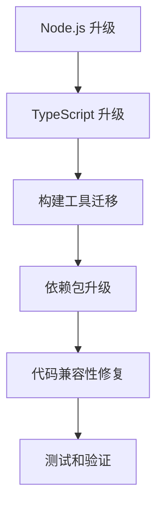

# Haiku Animator 升级计划：Node.js 8.15.1 到 Node.js 22，并迁移到 tsdown

## 项目概述

Haiku Animator 是一个用于创建 Lottie 动画和交互式 Web 组件的设计工具。当前项目基于 Node.js 8.15.1，使用 TypeScript 3.0.3 和 tsc 作为编译器。本计划旨在将项目升级到 Node.js 22，并将构建系统从 tsc 迁移到 tsdown。

## 升级状态

**状态**: ✅ 已完成

项目已成功完成以下升级：
- ✅ Node.js 从 8.15.1 升级到 22
- ✅ TypeScript 从 3.0.3 升级到 5.3.3
- ✅ 构建系统从 tsc 迁移到 tsdown 0.15.1
- ✅ 更新了所有相关配置文件
- ✅ 创建了新的文档和迁移指南

## 完成日期

**升级完成日期**: 2025年11月23日

## 1. 需要升级的核心依赖和建议版本

### 1.1 核心依赖升级

| 依赖名称 | 当前版本 | 建议版本 | 升级原因 |
|---------|---------|---------|---------|
| Node.js | 8.15.1 | 22.x | 主版本升级，提供更好的性能和安全性 |
| TypeScript | 3.0.3 | 5.x | 支持最新语言特性，与 Node.js 22 兼容 |
| Electron | 2.0.8 | 28.x | 与 Node.js 22 兼容，提供最新功能 |
| React | 15.6.2 | 18.x | 支持最新特性和性能优化 |
| Webpack | 4.16.0 | 5.x | 支持最新模块系统和优化 |
| tsc-watch | 1.0.27 | 移除 | 替换为 tsdown |
| tsdown | - | 最新版 | 替代 tsc，提供更好的开发体验 |

### 1.2 其他关键依赖升级

| 依赖名称 | 当前版本 | 建议版本 | 说明 |
|---------|---------|---------|-----|
| @types/node | 10.12.30 | 20.x | 与 Node.js 22 匹配 |
| @types/react | 15.6.11 | 18.x | 与 React 18 匹配 |
| ts-node | 6.1.0 | 10.x | 与 TypeScript 5 兼容 |
| tslint | 5.11.0 | 移除 | 替换为 ESLint |
| eslint | - | 最新版 | 替代 TSLint |
| @typescript-eslint/* | - | 最新版 | TypeScript ESLint 插件 |

## 2. 需要更新的配置文件

### 2.1 根目录配置文件

| 文件路径 | 更新内容 |
|---------|---------|
| `.nvmrc` | 更新 Node.js 版本到 22 |
| `package.json` | 更新所有依赖版本，替换构建脚本 |
| `yarn.lock` | 重新生成以匹配新依赖 |

### 2.2 TypeScript 配置文件

| 文件路径 | 更新内容 |
|---------|---------|
| `packages/haiku-glass/tsconfig.json` | 更新编译选项，移除已弃用选项 |
| `packages/haiku-plumbing/tsconfig.json` | 更新编译选项，移除已弃用选项 |
| `packages/haiku-formats/tsconfig.json` | 更新编译选项，移除已弃用选项 |
| `packages/haiku-sdk-creator/tsconfig.json` | 更新编译选项，移除已弃用选项 |

### 2.3 构建脚本

| 文件路径 | 更新内容 |
|---------|---------|
| `scripts/compile-all.js` | 修改为使用 tsdown 而非 tsc |
| `scripts/watch-all.js` | 替换 tsc-watch 为 tsdown 监听模式 |
| `scripts/compile-package.js` | 修改为使用 tsdown |
| 各子包的 `package.json` | 更新编译脚本 |

## 3. 从 tsc 迁移到 tsdown 的具体需求

### 3.1 当前 tsc 使用方式分析

项目当前使用 tsc 的方式：
1. 各子包独立编译，输出到 `lib` 目录
2. 使用 `tsc --watch` 进行开发时监听
3. 使用 `tsc-watch` 包提供更好的监听体验
4. 通过 `scripts/compile-all.js` 批量编译所有包

### 3.2 tsdown 的优势和配置差异

**tsdown 优势：**
- 更快的编译速度
- 更好的开发体验
- 内置监听模式
- 更简洁的配置
- 更好的错误处理

**配置差异：**
- tsdown 使用 `tsdown.config.ts` 而非 `tsconfig.json`
- 输出目录结构可能不同
- 插件系统与 tsc 不同

### 3.3 迁移策略

1. **渐进式迁移**：先在单个包中试点 tsdown
2. **保持输出兼容**：确保输出结构与当前一致
3. **并行开发**：在迁移过程中保持 tsc 可用
4. **CI/CD 更新**：更新构建流程以使用 tsdown

### 3.4 潜在挑战

1. **配置差异**：tsconfig 到 tsdown.config 的转换
2. **插件兼容性**：某些 tsc 插件可能不兼容
3. **输出格式**：可能需要调整输出目录结构
4. **团队学习成本**：团队需要适应新工具

## 4. 更新优先级和依赖关系

### 4.1 更新优先级

### 4.2 必须首先更新的组件

1. **Node.js 环境**：所有其他升级的基础
2. **TypeScript 编译器**：代码兼容性的基础
3. **构建工具**：影响整个开发流程

### 4.3 可以并行更新的组件

1. **非核心依赖**：如 lodash、moment 等
2. **测试工具**：如 tape、nyc 等
3. **开发工具**：如 ESLint 配置等

### 4.4 可能的冲突和解决方案

| 冲突 | 解决方案 |
|-----|---------|
| Node.js 22 与旧原生模块不兼容 | 重新编译或寻找替代品 |
| TypeScript 5 语法检查更严格 | 逐步修复类型错误 |
| React 15 到 18 的 API 变化 | 使用 codemod 自动迁移 |
| tsdown 输出格式不同 | 配置 tsdown 保持兼容 |

## 5. 可能需要重构的代码部分

### 5.1 使用了已弃用 API 的代码

1. **Node.js API**：
   - `require('util').promisify` 的使用方式
   - 文件系统 API 的异步模式
   - URL 解析相关 API

2. **TypeScript 特性**：
   - 命名空间的使用
   - 类型声明合并
   - 装饰器语法

3. **React API**：
   - `React.PropTypes` 到 `prop-types` 库
   - 生命周期方法的变化
   - Context API 的使用

### 5.2 可能不兼容新版本的代码模式

1. **模块系统**：
   - CommonJS 到 ES Module 的迁移
   - 动态导入的使用

2. **异步处理**：
   - Promise 链式调用
   - async/await 模式

3. **错误处理**：
   - 未捕获的 Promise 拒绝
   - 错误堆栈处理

## 6. 具体升级步骤

### 阶段 1：环境准备

1. 更新 `.nvmrc` 文件
2. 更新本地开发环境
3. 验证 Node.js 22 兼容性

### 阶段 2：核心依赖升级

1. 升级 TypeScript 到 5.x
2. 更新相关类型定义
3. 修复初始编译错误

### 阶段 3：构建工具迁移

1. 安装和配置 tsdown
2. 创建 tsdown 配置文件
3. 更新构建脚本
4. 测试编译输出

### 阶段 4：依赖包升级

1. 升级 React 到 18.x
2. 升级 Electron 到 28.x
3. 升级其他依赖包
4. 解决兼容性问题

### 阶段 5：代码重构

1. 修复已弃用 API 的使用
2. 更新不兼容的代码模式
3. 添加必要的类型声明
4. 优化代码结构

### 阶段 6：测试和验证

1. 运行完整测试套件
2. 验证构建流程
3. 测试应用功能
4. 性能基准测试

## 7. 风险评估和缓解策略

### 7.1 主要风险

1. **兼容性风险**：新版本可能引入不兼容的变更
2. **性能风险**：新工具可能影响构建性能
3. **稳定性风险**：大量变更可能引入新 bug
4. **时间风险**：升级可能比预期耗时更长

### 7.2 缓解策略

1. **分支策略**：在独立分支进行升级
2. **回滚计划**：保留当前版本的完整备份
3. **渐进式部署**：分阶段进行升级
4. **充分测试**：在每个阶段进行彻底测试

## 8. 后续优化建议

1. **性能优化**：利用新版本特性优化应用性能
2. **代码现代化**：使用最新语言特性重构代码
3. **构建优化**：优化构建流程和配置
4. **开发体验**：改进开发工具和流程

## 9. 时间估算

| 阶段 | 预估时间 | 说明 |
|-----|---------|-----|
| 环境准备 | 1-2 天 | 包括环境设置和验证 |
| 核心依赖升级 | 3-5 天 | 主要解决兼容性问题 |
| 构建工具迁移 | 2-4 天 | 配置和测试新工具 |
| 依赖包升级 | 5-7 天 | 解决各种依赖冲突 |
| 代码重构 | 7-10 天 | 修复不兼容代码 |
| 测试和验证 | 3-5 天 | 全面测试和优化 |
| **总计** | **21-33 天** | 约 1-1.5 个月 |

## 10. 成功标准

1. 所有测试通过
2. 构建流程正常工作
3. 应用功能完整
4. 性能不低于当前版本
5. 开发体验改善

---

*本计划将根据实际升级过程中的发现进行动态调整。*